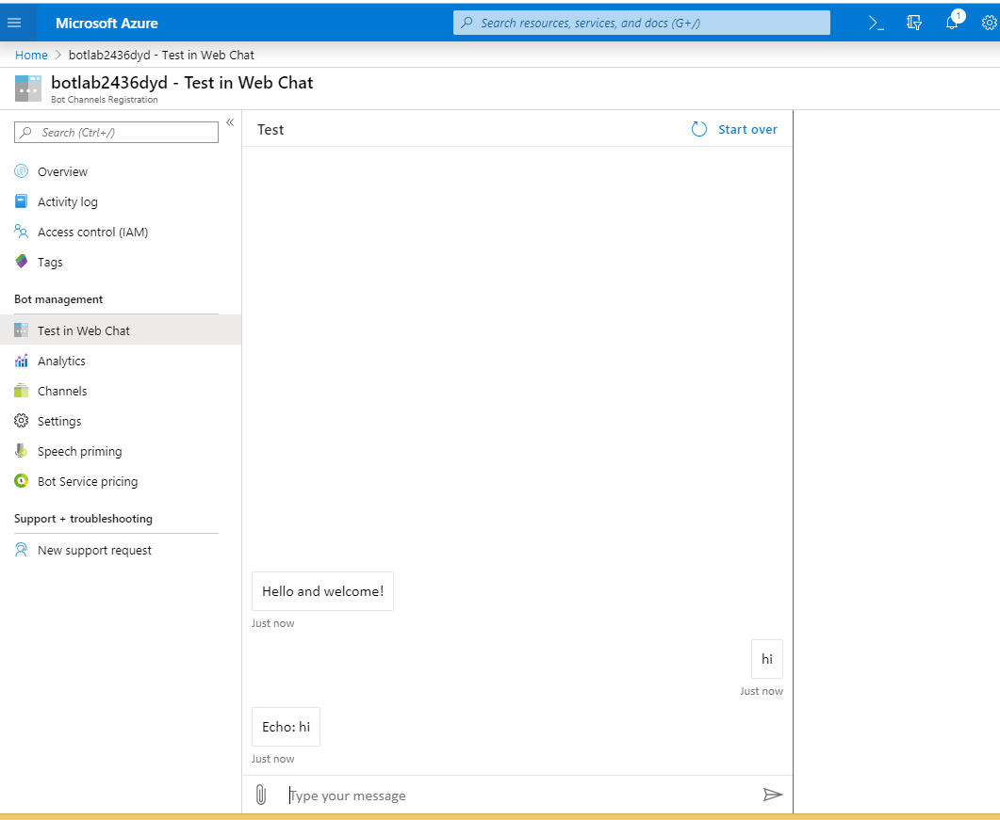

# Workshop-BotFramework

In this workshop, you will learn how :
 * Build Chat Bot using Bot Framework SDK v4 and Visual Studio 2019
 * Debug and test your bot with Bot Emulator
 * Deploy your bot on Azure Bot Service
 * Use Dialog library to manage a conversation with the user


## Pre-requisites

 * [Visual Studio 2019](https://www.visualstudio.com/downloads)
 * [Bot Framework Emulator](https://aka.ms/bot-framework-emulator-readme)
 * [Knowledge of ASP.Net Core](https://docs.microsoft.com/aspnet/core/) 
 * [Subscription to Microsoft Azure](https://azure.microsoft.com/free/)
 * [Latest version of the Azure CLI](https://docs.microsoft.com/cli/azure/?view=azure-cli-latest)

## Install Bot Framework SDK v4 template for C#

 1. Open Visual Studio. Select Extenions on the menu bar and click on Manage Extenions.

 1. Search Bot and download Bot Framework v4 SDK Templates for Visual Studio.

 
 
 3. Close Visual Studio and install extension.

## Create and test a bot locally
 
### Create a bot

In Visual Studio, create a new bot project using the **Echo Bot (Bot Framework v4)** template. Enter _bot framework v4_ in the search box to show only bot templates.


> [!TIP] 
> If using Visual Studio 2017, make sure that the project build type is ``.Net Core 2.1`` or later. Also if needed, update the `Microsoft.Bot.Builder` [NuGet packages](https://docs.microsoft.com/nuget/quickstart/install-and-use-a-package-in-visual-studio).

Thanks to the template, your project contains all the code that's necessary to create the bot in this quickstart. You won't actually need to write any additional code.

### Start your bot in Visual Studio

When you click the run button, Visual Studio will build the application, deploy it to localhost, and launch the web browser to display the application's `default.htm` page. At this point, your bot is running locally.

### Start the emulator and connect your bot

Next, start the emulator and then connect to your bot in the emulator:

1. Click the **Create a new bot configuration** link in the emulator "Welcome" tab. 
1. Fill out the fields for your bot. Use your bot's welcome page address (typically http://localhost:3978) and append routing info '/api/messages' to this address.
1. then click **Save and connect**.

### Interact with your bot

Send a message to your bot, and the bot will respond back with a message.


> [!NOTE]
> If you see that the message cannot be sent, you might need to restart your machine as ngrok didn't get the needed privileges on your system yet (only needs to be done one time).

## Understand the Bot structure

For dotnet platform, a bot is a ASP.NET Core web application.

The VSIX template generates a [ASP.NET MVC Core](https://dotnet.microsoft.com/apps/aspnet/mvc) web app. If you look at the [ASP.NET](https://docs.microsoft.com/aspnet/core/fundamentals/index?view=aspnetcore-2.1&tabs=aspnetcore2x) fundamentals, you'll see similar code in files such as **Program.cs** and **Startup.cs**. These files are required for all web apps and are not bot specific.

### appsettings.json file

The **appsettings.json** file specifies the configuration information for your bot, such as the app ID, and password among other things. If using certain technologies or using this bot in production, you will need to add your specific keys or URL to this configuration. For this Echo bot, however, you don't need to do anything here right now; the app ID and password may be left undefined at this time.

### Bot logic

The bot logic processes incoming activities from one or more channels and generates outgoing activities in response.

The main bot logic is defined in the bot code, here called `Bots/EchoBot.cs`. `EchoBot` derives from `ActivityHandler`, which in turn derives from the `IBot` interface. `ActivityHandler` defines various handlers for different types of activities, such as the two defined here: `OnMessageActivityAsync`, and `OnMembersAddedAsync`. These methods are protected, but can be overwritten since we're deriving from `ActivityHandler`.

The handlers defined in `ActivityHandler` are:

| Event | Handler | Description |
| :-- | :-- | :-- |
| Any activity type received | `OnTurnAsync` | Calls one of the other handlers, based on the type of activity received. |
| Message activity received | `OnMessageActivityAsync` | Override this to handle a `message` activity. |
| Conversation update activity received | `OnConversationUpdateActivityAsync` | On a `conversationUpdate` activity, calls a handler if members other than the bot joined or left the conversation. |
| Non-bot members joined the conversation | `OnMembersAddedAsync` | Override this to handle members joining a conversation. |
| Non-bot members left the conversation | `OnMembersRemovedAsync` | Override this to handle members leaving a conversation. |
| Event activity received | `OnEventActivityAsync` | On an `event` activity, calls a handler specific to the event type. |
| Token-response event activity received | `OnTokenResponseEventAsync` | Override this to handle token response events. |
| Non-token-response event activity received | `OnEventAsync` | Override this to handle other types of events. |
| Message reaction activity received | `OnMessageReactionActivityAsync` | On a `messageReaction` activity, calls a handler if one or more reactions were added or removed from a message. |
| Message reactions added to a message | `OnReactionsAddedAsync` | Override this to handle reactions added to a message. |
| Message reactions removed from a message | `OnReactionsRemovedAsync` | Override this to handle reactions removed from a message. |
| Other activity type received | `OnUnrecognizedActivityTypeAsync` | Override this to handle any activity type otherwise unhandled. |

These different handlers have a `turnContext` that provides information about the incoming activity, which corresponds to the inbound HTTP request. Activities can be of various types, so each handler provides a strongly-typed activity in its turn context parameter; in most cases, `OnMessageActivityAsync` will always be handled, and is generally the most common.

In this sample, we welcome a new user or echo back the message the user sent using the `SendActivityAsync` call. The outbound activity corresponds to the outbound HTTP POST request.

```cs
public class MyBot : ActivityHandler
{
    protected override async Task OnMessageActivityAsync(ITurnContext<IMessageActivity> turnContext, CancellationToken cancellationToken)
    {
        await turnContext.SendActivityAsync(MessageFactory.Text($"Echo: {turnContext.Activity.Text}"), cancellationToken);
    }

    protected override async Task OnMembersAddedAsync(IList<ChannelAccount> membersAdded, ITurnContext<IConversationUpdateActivity> turnContext, CancellationToken cancellationToken)
    {
        foreach (var member in membersAdded)
        {
            await turnContext.SendActivityAsync(MessageFactory.Text($"welcome {member.Name}"), cancellationToken);
        }
    }
}
```

### Set up services

The `ConfigureServices` method in the `Startup.cs` file loads the connected services, as well as their keys from `appsettings.json` or Azure Key Vault (if there are any), connects state, and so on. Here, we're adding MVC and setting the compatibility version on our services, then setting up the adapter and bot to be available through dependency injection to the bot controller.


```csharp
// This method gets called by the runtime. Use this method to add services to the container.
public void ConfigureServices(IServiceCollection services)
{
    services.AddMvc().SetCompatibilityVersion(CompatibilityVersion.Version_2_1);

    // Create the credential provider to be used with the Bot Framework Adapter.
    services.AddSingleton<ICredentialProvider, ConfigurationCredentialProvider>();

    // Create the Bot Framework Adapter.
    services.AddSingleton<IBotFrameworkHttpAdapter, BotFrameworkHttpAdapter>();

    // Create the bot as a transient. In this case the ASP Controller is expecting an IBot.
    services.AddTransient<IBot, EchoBot>();
}
```

The `Configure` method finishes the configuration of your app by specifying that the app use MVC and a few other files. All bots using the Bot Framework will need that configuration call, however that will already be defined in samples or the VSIX template when you build your bot. `ConfigureServices` and `Configure` are called by the runtime when the app starts.

### Bot Controller

The controller, following the standard MVC structure, lets you determine the routing of messages and HTTP POST requests. For our bot, we pass the incoming request on to the adapter's *process async activity* method as explained in the [activity processing stack](#the-activity-processing-stack) section above. In that call, we specify the bot and any other authorization information that may be required.

The controller implements `ControllerBase`, holds the adapter and bot that we set in `Startup.cs` (that are available here through dependency injection), and passes the necessary information on to the bot when it receives an incoming HTTP POST.

Here, you'll see the class proceeded by route and controller attributes. These assist the framework to route the messages appropriately and know which controller to use. If you change the value in the route attribute, that changes the endpoint the emulator or other channels use access your bot.

```cs
// This ASP Controller is created to handle a request. Dependency Injection will provide the Adapter and IBot
// implementation at runtime. Multiple different IBot implementations running at different endpoints can be
// achieved by specifying a more specific type for the bot constructor argument.
[Route("api/messages")]
[ApiController]
public class BotController : ControllerBase
{
    private readonly IBotFrameworkHttpAdapter Adapter;
    private readonly IBot Bot;

    public BotController(IBotFrameworkHttpAdapter adapter, IBot bot)
    {
        Adapter = adapter;
        Bot = bot;
    }

    [HttpPost]
    public async Task PostAsync()
    {
        // Delegate the processing of the HTTP POST to the adapter.
        // The adapter will invoke the bot.
        await Adapter.ProcessAsync(Request, Response, Bot);
    }
}

```
### Update Welcome message

Open the Bots/EchoBot.cs. Update the OnMembersAddedAsync method, replace the text Hello and Welcome! with the following text:

```
"Hi! I'm a AI Bootcamp assistant bot. I can help you with your registration."
```

## Deploy your bot

### Prepare for deployment

When you create a bot using the [Visual Studio template](https://docs.microsoft.com/azure/bot-service/dotnet/bot-builder-dotnet-sdk-quickstart?view=azure-bot-service-4.0) or [Yeoman template](https://docs.microsoft.com/azure/bot-service/javascript/bot-builder-javascript-quickstart?view=azure-bot-service-4.0), the source code generated includes a `deploymentTemplates` folder that contains ARM templates. The deployment process documented here uses one of the ARM templates to provision required resources for the bot in Azure by using the Azure CLI. 

#### 1. Login to Azure

Once you've created and tested a bot locally, you can deploy it to Azure. Open a command prompt to log in to the Azure portal.

```cmd
az login
```
A browser window will open, allowing you to sign in.

#### 2. Set the subscription

Set the default subscription to use.

```cmd
az account set --subscription "<azure-subscription>"
```

If you are not sure which subscription to use for deploying the bot, you can view the list of subscriptions for your account by using `az account list` command. Set the default subscription to use.

#### 3. Create an App registration

Registering the application means that you can use Azure AD to authenticate users and request access to user resources. Your bot requires a Registered app in Azure that provides the bot access to the Bot Framework Service for sending and receiving authenticated messages. To create register an app via the Azure CLI, perform the following command:

```cmd
az ad app create --display-name "displayName" --password "AtLeastSixteenCharacters_0" --available-to-other-tenants
```

| Option   | Description |
|:---------|:------------|
| display-name | The display name of the application. |
| password | App password, aka 'client secret'. The password must be at least 16 characters long, contain at least 1 upper or lower case alphabetical character, and contain at least 1 special character.|
| available-to-other-tenants| Indicates whether the application can be used from any Azure AD tenant. Set to `true` to enable your bot to work with the Azure Bot Service channels.|

The above command outputs JSON with the key `appId`, save the value of this key for the ARM deployment, where it will be used for the `appId` parameter. The password provided will be used for the `appSecret` parameter.

#### 4. Deploy via ARM template

You'll create a new resource group in Azure and then use the ARM template to create the resources specified in it. In this case, we are providing App Service Plan, Web App, and Bot Channels Registration.

```cmd
az deployment create --name "<name-of-deployment>" --template-file "template-with-new-rg.json" --location "location-name" --parameters appId="<msa-app-guid>" appSecret="<msa-app-password>" botId="<id-or-name-of-bot>" botSku=F0 newAppServicePlanName="<name-of-app-service-plan>" newWebAppName="<name-of-web-app>" groupName="<new-group-name>" groupLocation="<location>" newAppServicePlanLocation="<location>"
```

| Option   | Description |
|:---------|:------------|
| name | Friendly name for the deployment. |
| template-file | The path to the ARM template. You can use the `template-with-new-rg.json` file provided in the `deploymentTemplates` folder of the project. |
| location |Location. Values from: `az account list-locations`. You can configure the default location using `az configure --defaults location=<location>`. |
| parameters | Provide deployment parameter values. `appId` value you got from running the `az ad app create` command. `appSecret` is the password you provided in the previous step. The `botId` parameter should be globally unique and is used as the immutable bot ID. It is also used to configure the display name of the bot, which is mutable. `botSku` is the pricing tier and can be F0 (Free) or S1 (Standard). `newAppServicePlanName` is the name of App Service Plan. `newWebAppName` is the name of the Web App you are creating. `groupName` is the name of the Azure resource group you are creating. `groupLocation` is the location of the Azure resource group. `newAppServicePlanLocation` is the location of the App Service Plan. |

#### 5. Prepare your code for deployment

You need to prepare your project files before you can deploy your bot. 

```cmd
az bot prepare-deploy --lang Csharp --code-dir "." --proj-file-path "MyBot.csproj"
```

You must provide the path to the .csproj file relative to --code-dir. This can be performed via the --proj-file-path argument. The command would resolve --code-dir and --proj-file-path to "./MyBot.csproj".

> [!NOTE]
>  For C# bots, the `az bot prepare-depoloy` command should generate a `.deployment` file in your bot project folder

When using the non-configured [zip deploy API](https://github.com/projectkudu/kudu/wiki/Deploying-from-a-zip-file-or-url) to deploy your bot's code, Web App/Kudu's behavior is as follows:

_Kudu assumes by default that deployments from zip files are ready to run and do not require additional build steps during deployment, such as npm install or dotnet restore/dotnet publish._

As such, it is important to include your built code and with all necessary dependencies in the zip file being deployed to the Web App, otherwise your bot will not work as intended.

> [!IMPORTANT]
> Before zipping your project files, make sure that you are _in_ the project folder. 
> - For C# bots, it is the folder that has the .csproj file. 
>
>**Within** the project folder, select all the files and folders you want included in your zip file before running the command to create the zip file, this will create a single zip file containing all selected files and folders.
>
> If your root folder location is incorrect, the **bot will fail to run in the Azure portal**.

### Deploy code to Azure

At this point we are ready to deploy the code to the Azure Web App. Run the following command from the command line to perform deployment using the kudu zip push deployment for a web app.

```cmd
az webapp deployment source config-zip --resource-group "<resource-group-name>" --name "<name-of-web-app>" --src "code.zip" 
```

| Option   | Description |
|:---------|:------------|
| resource-group | The name of the Azure resource group that contains your bot. (This will be the resource group you used or created when creating the app registration for your bot.) |
| name | Name of the Web App you used earlier. |
| src  | The path to the zipped file you created. |

### Test in Web Chat

1. In your browser, navigate to the [Azure portal](https://ms.portal.azure.com).
2. In the left panel, click **Resource groups**.
3. In the right panel, search for your group.
4. Click on your group name.
5. Click the link of your Bot Channel Registration.
6. In the **Bot Channel Registration** panel, click **Test in Web Chat**.
Alternatively, in the right panel, click the **Test** box.



For more information about channel registration, see [Register a bot with Bot Service](https://docs.microsoft.com/azure/bot-service/bot-service-quickstart-registration?view=azure-bot-service-3.0).

## Add advanced conversational features to your bot

### Key concepts of Dialogs

#### About Dialogs 

Dialogs are a central concept in the SDK, and provide a useful way to manage a conversation with the user. Dialogs are structures in your bot that act like functions in your bot's program; each dialog is designed to perform a specific task, in a specific order. You can specify the order of individual dialogs to guide the conversation, and invoke them in different ways - sometimes in response to a user, sometimes in response to some outside stimuli, or from other dialogs.

#### Prompts

Prompts, within the dialogs library, provide an easy way to ask the user for information and evaluate their response. For example for a number prompt, you specify the question or information you are asking for, and the prompt automatically checks to see if it received a valid number response. If it did, the conversation can continue; if it didn't, it will re-prompt the user for a valid answer.

#### Waterfall dialogs

A waterfall dialog is a specific implementation of a dialog that is commonly used to collect information from the user or guide the user through a series of tasks. Each step of the conversation is implemented as an asynchronous function that takes a waterfall step context (step) parameter. At each step, the bot prompts the user for input (or can begin a child dialog, but that it is often a prompt), waits for a response, and then passes the result to the next step. The result of the first function is passed as an argument into the next function, and so on.

The following diagram shows a sequence of waterfall steps and the stack operations that take place. Details on the use of the dialog stack are below in the using dialogs section.


### Create the main Dialog

In this workshop, we use a waterfall dialog, a few prompts, and a component dialog to create a simple interaction that asks the user a series of questions. The code uses a dialog to cycle through these steps:

| Steps        | Prompt type  |
|:-------------|:-------------|
| Ask the user for their firstnname | Text prompt |
| Ask the user for their last name | Text prompt |
| Ask the user for their email | Text prompt with validation to only accept valid email|
| Ask the user for their job title | Choice prompt |
| Display the collected information | Confirm prompt |


#### Install Dialogs librairy

To use dialogs, install the Microsoft.Bot.Builder.Dialogs NuGet package.


#### Create RegisterData.cs

The collected information are saved in an instance of RegisterData.cs. Add new Class in your project with this code :

```
 public class RegisterData
    {
            public string FirstName { get; set; }

            public string LastName { get; set; }

            public string Email { get; set; }

            public string Profile { get; set; }

           public int AmountPeople { get; set; } 
    }
```

#### Create RegisterDialog.cs

Create new folder Dialogs and add new file RegisterDialog.cs. RegisterDialog class must derives from  the ComponentDialog class and have accessor property for RegisterData.

```
 public class RegisterDialog : ComponentDialog
    {
        private readonly IStatePropertyAccessor<RegisterData> _registerDataAccessor;

    }
```

In the RegisterDialog constructor, create the waterfall steps, prompts and the waterfall dialog, and add them to the dialog set. The prompts need to be in the same dialog set in which they are used.

```
public RegisterDialog (UserState userState) : base(nameof(RegisterDialog))
{
   _registerDataAccessor = userState.CreateProperty<RegisterData>("RegisterData");

    // This array defines how the Waterfall will execute.
    var waterfallSteps = new WaterfallStep[]
    {
        FirstNameStepAsync,
        LastNameStepAsync,
        EmailStepAsync,
        ProfileStepAsync,
        AmountPeopleStepAsync,
        SummaryStepAsync,
    };

        // Add named dialogs to the DialogSet. These names are saved in the dialog state.
        AddDialog(new WaterfallDialog(nameof(WaterfallDialog), waterfallSteps));
        AddDialog(new TextPrompt(nameof(TextPrompt)));
        AddDialog(new TextPrompt("email", EmailPromptValidatorAsync));
        AddDialog(new ChoicePrompt(nameof(ChoicePrompt)));
        AddDialog(new NumberPrompt<int>(nameof(NumberPrompt<int>), AmountPeoplePromptValidatorAsync));
        AddDialog(new ConfirmPrompt(nameof(ConfirmPrompt)));

        // The initial child Dialog to run.
            InitialDialogId = nameof(WaterfallDialog);
        }
```
You need to implement functions for each Wartefall step and validation.

```
private async Task<DialogTurnResult> FirstNameStepAsync(WaterfallStepContext stepContext, CancellationToken cancellationToken)
        {

            throw new NotImplementedException();

        }

        private async Task<DialogTurnResult> LastNameStepAsync(WaterfallStepContext stepContext, CancellationToken cancellationToken)
        {
            throw new NotImplementedException();
        }

        private async Task<DialogTurnResult> EmailStepAsync(WaterfallStepContext stepContext, CancellationToken cancellationToken)
        {
            throw new NotImplementedException();
        }

         private async Task<DialogTurnResult> ProfileStepAsync(WaterfallStepContext stepContext, CancellationToken cancellationToken)
        {
            throw new NotImplementedException();
        }

        private async Task<DialogTurnResult> AmountPeopleStepAsync(WaterfallStepContext stepContext, CancellationToken cancellationToken)
        {
            throw new NotImplementedException();
        }


        private async Task<DialogTurnResult> SummaryStepAsync(WaterfallStepContext stepContext, CancellationToken cancellationToken)
        {
            throw new NotImplementedException();
        }

        private Task<bool> EmailPromptValidatorAsync(PromptValidatorContext<string> promptContext, CancellationToken cancellationToken)
        {
            throw new NotImplementedException();
        }

        private Task<bool> AmountPeoplePromptValidatorAsync(PromptValidatorContext<int> promptContext, CancellationToken cancellationToken)
        {
            throw new NotImplementedException();
        }
```

#### Step 1 : Ask first name

The first step call the Prompt dialog and ask the user first name.

Behind the scenes, prompts are a two-step dialog. First, the prompt asks for input; second, it returns the valid value, or starts over from the beginning with a reprompt until it receives a valid input.

```
 private async Task<DialogTurnResult> FirstNameStepAsync(WaterfallStepContext stepContext, CancellationToken cancellationToken)
        {

            // WaterfallStep always finishes with the end of the Waterfall or with another dialog; here it is a Prompt Dialog.
            // Running a prompt here means the next WaterfallStep will be run when the user's response is received.

            return await stepContext.PromptAsync(nameof(TextPrompt), new PromptOptions { Prompt = MessageFactory.Text("Please enter your fisrt name.") }, cancellationToken);

        }
```

#### Step 2 : Ask last name 

The prompt result is retrieved across stepContext.Result.

```
 private async Task<DialogTurnResult> LastNameStepAsync(WaterfallStepContext stepContext, CancellationToken cancellationToken)
        {

            stepContext.Values["firstname"] = (string)stepContext.Result;

            return await stepContext.PromptAsync(nameof(TextPrompt), new PromptOptions { Prompt = MessageFactory.Text("Please enter your last name.") }, cancellationToken);

        }
```

#### Step 3 : Ask  email

In EmailStepAsync, we specify a retry prompt for when the user's input fails to validate.

```
 private async Task<DialogTurnResult> EmailStepAsync(WaterfallStepContext stepContext, CancellationToken cancellationToken)
        {

            stepContext.Values["lastname"] = (string)stepContext.Result;

            // We can send messages to the user at any point in the WaterfallStep.
            await stepContext.Context.SendActivityAsync(MessageFactory.Text($"Thanks {(string)stepContext.Values["firstname"]} {stepContext.Result}."), cancellationToken);

            // WaterfallStep always finishes with the end of the Waterfall or with another dialog; here it is a Prompt Dialog.
            return await stepContext.PromptAsync("email", new PromptOptions { Prompt = MessageFactory.Text("Please enter your email."), 
                RetryPrompt = MessageFactory.Text("Please enter valid email.") }, cancellationToken);
        }
```

#### Step 4 : Ask job title

```
 private async Task<DialogTurnResult> ProfileStepAsync(WaterfallStepContext stepContext, CancellationToken cancellationToken)
        {
            stepContext.Values["email"] = (string)stepContext.Result;

            return await stepContext.PromptAsync(nameof(ChoicePrompt),
                new PromptOptions
                {
                    Prompt = MessageFactory.Text("Please select your job title."),
                    Choices = ChoiceFactory.ToChoices(new List<string> { "Developer", "Administrator", "Analyst", "Architect" }),
                }, cancellationToken);
        }
```

#### Step 5 : Ask number of people

In AmountPeopleStepAsync, we specify a retry prompt for when the user's input fails to validate, either because it is in a format that the prompt can not parse, or the input fails a validation criteria. 

```
 private async Task<DialogTurnResult> AmountPeopleStepAsync(WaterfallStepContext stepContext, CancellationToken cancellationToken)
        {
            stepContext.Values["profile"] = ((FoundChoice)stepContext.Result).Value;

            return await stepContext.PromptAsync(nameof(NumberPrompt<int>), new PromptOptions { Prompt = MessageFactory.Text("Please enter number of attendees (max 3)."),
            RetryPrompt = MessageFactory.Text("The value entered must be greater than 0 and less or equal than 3.") }, cancellationToken);

        }
```

#### Step 6 : Summary

In last step, we call register data accessor to get RegisterData object (_registerDataAccessor.GetAsync()) and then set the values with collected data. Finally we send the confirmation message before calling EndDialogAsync which ends the dialog.

```
   private async Task<DialogTurnResult> SummaryStepAsync(WaterfallStepContext stepContext, CancellationToken cancellationToken)
        {
            stepContext.Values["amountpeople"] = (int)stepContext.Result;

            // Get the current registerData object from user state.
            var registerData = await _registerDataAccessor.GetAsync(stepContext.Context, () => new RegisterData(), cancellationToken);

            registerData.FirstName = (string)stepContext.Values["firstname"];
            registerData.LastName = (string)stepContext.Values["lastname"];
            registerData.Email = (string)stepContext.Values["email"];
            registerData.Profile = (string)stepContext.Values["profile"];
            registerData.AmountPeople = (int)stepContext.Values["amountpeople"];

            var msg = $"Thanks for your registration. We are reserved {registerData.AmountPeople} seat for you.";

            await stepContext.Context.SendActivityAsync(MessageFactory.Text(msg), cancellationToken);

            // WaterfallStep always finishes with the end of the Waterfall or with another dialog; here it is the end.
            return await stepContext.EndDialogAsync(cancellationToken: cancellationToken);
        }
```

### Run the dialog

Inside the Bots folder, ddd DialogBot.cs with this lines of code.

```
 public class DialogBot<T> : ActivityHandler where T : Dialog
    {

       protected readonly Dialog Dialog;
        protected readonly BotState ConversationState;
        protected readonly BotState UserState;
        protected readonly ILogger Logger;


         public DialogBot(ConversationState conversationState, UserState userState, T dialog, ILogger<DialogBot<T>> logger)
        {
            ConversationState = conversationState;
            UserState = userState;
            Dialog = dialog;
            Logger = logger;
        }

    }
    ```


